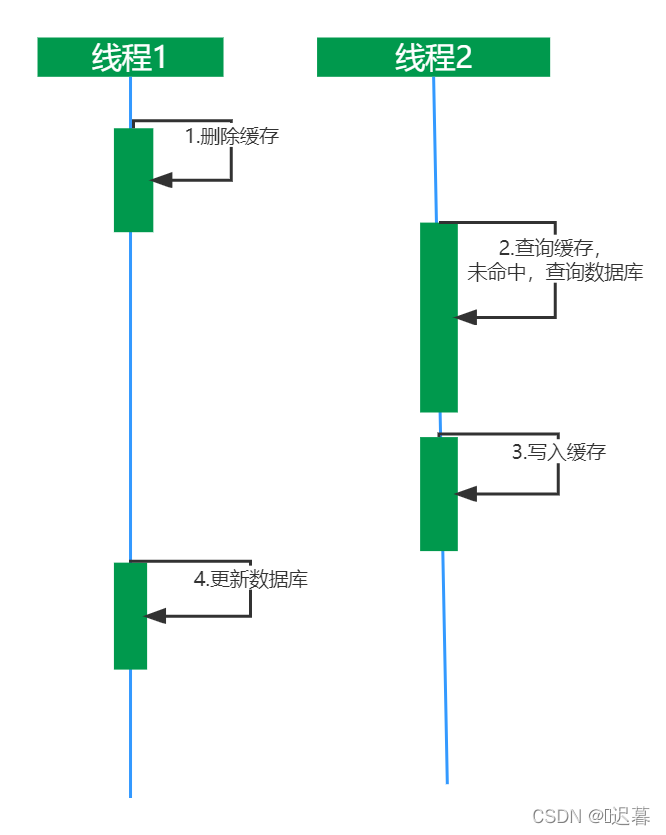

[https://blog.csdn.net/qq_53946134/article/details/124152981](https://blog.csdn.net/qq_53946134/article/details/124152981)

先删除缓存，再操作数据库

可能存在的问题：如果线程1删除缓存，由于逻辑再太复杂，还没由更新完数据库，这时线程2，进行查询缓存，发现缓存没有，进行查询数据库，查询到还未更改的数据，线程2将查询到数据写入缓存中，再写入缓存中操作完成后，线程1更新数据库，

最终会导致：缓存中的数据还是原来的数据，数据库中数据时新数据。

